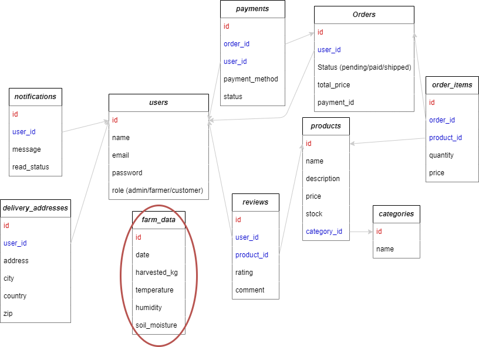

# EpiOlive

## Overview
EpiOlive is a farm management system designed for olive tree farms, integrating modern technology with traditional agriculture. The platform helps farmers monitor essential data such as temperature, humidity, and soil moisture using IoT sensors. Additionally, it supports order management, farm analytics, and user authentication to streamline operations. By leveraging Laravel, MySQL, and MongoDB, EpiOlive ensures a scalable and efficient backend while maintaining high-performance data handling.

## Tools & Technologies  
EpiOlive is built using a **Dockerized Laravel environment** with **MySQL and MongoDB** for hybrid data storage. The backend utilizes Laravel's Eloquent ORM for relational data and Jenssegers/MongoDB package for NoSQL integration. The project is containerized with **Docker Compose**, ensuring easy deployment. Future expansions may include **a Vue.js or React frontend**, **IoT device integration**, and **cloud hosting** to enhance farm automation.

### Database

    

**Relationships:**

- A user can place multiple orders.
- An order consists of multiple products (order_items).
- Farm data is recorded daily.
- Payments are linked to orders.
- A user can write multiple reviews.

*Because MongoDB handles large, frequent records better (ideal for IoT sensor logs), a marriage will be made between MongoDB and MySQL which will be used for the core of the application (user and product management, payment system, etc.).*

### Controllers & Endpoints

- Authentication (Laravel Sanctum or Passport)
- Products & Categories
- Orders & Payments
- Farm Data Tracking
- Reviews & Ratings
- Notifications